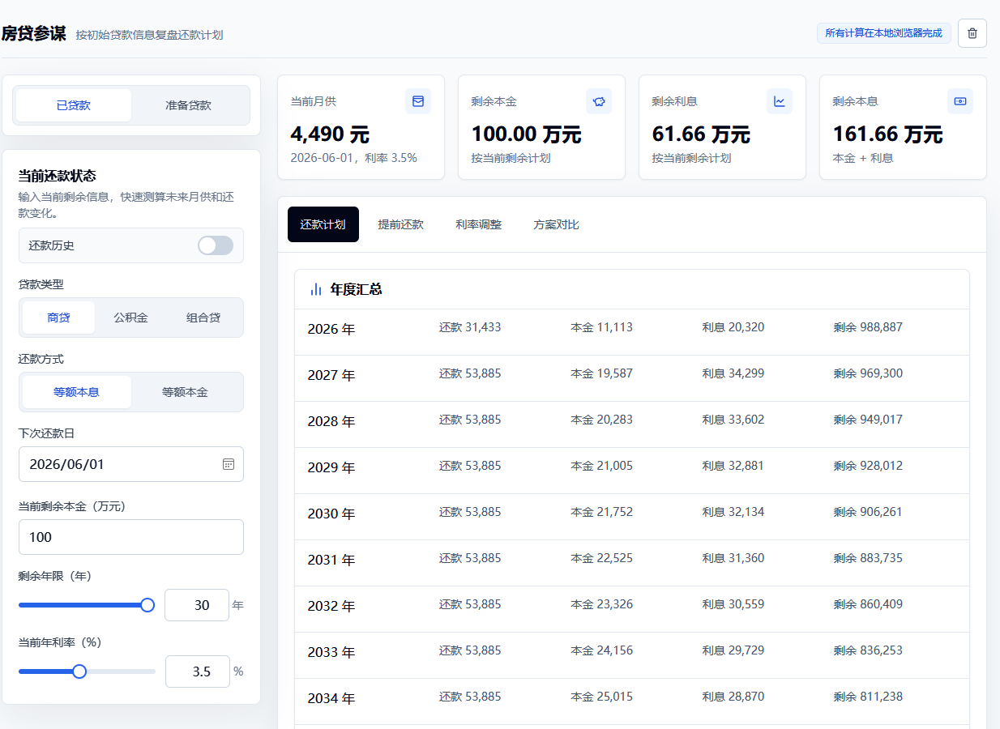
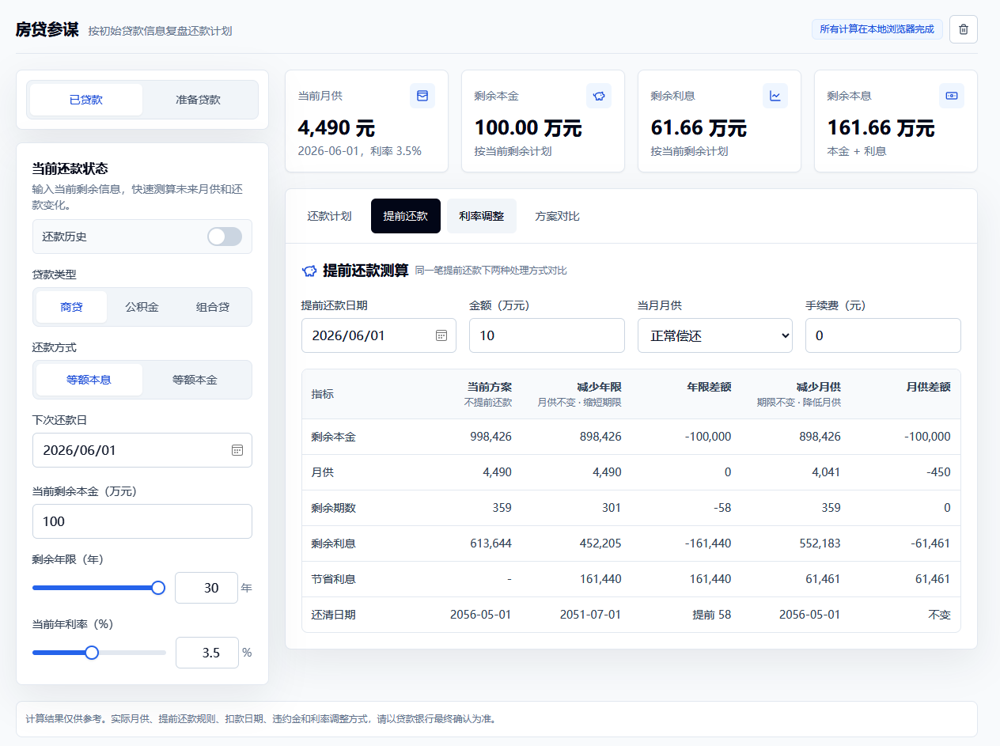
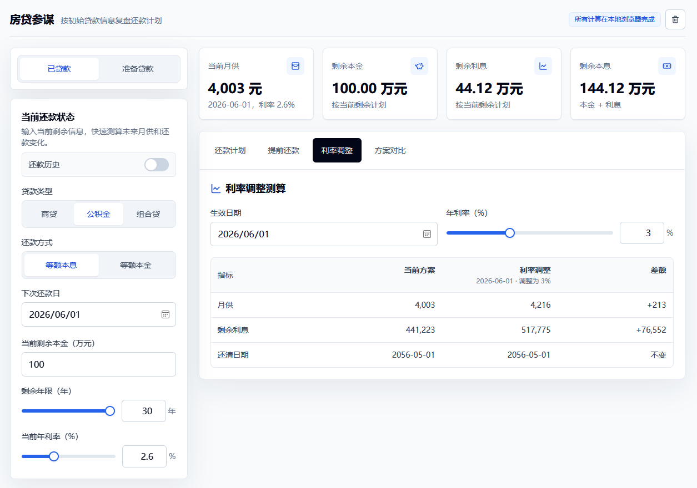

# 房贷参谋

房贷全周期计算与决策工具。所有计算都在本地浏览器完成，无需联网，不上传任何数据。

## 界面预览







## 功能

**贷款规划（准备贷款）**

- 商贷 / 公积金贷 / 组合贷三种贷款类型
- 等额本息 / 等额本金两种还款方式
- 月供、总利息、总还款额一览

**已贷款复盘（已贷款模式）**

- 根据当前剩余状态快速测算未来还款
- 还款历史记录：支持多次利率变动与提前还款
- 真实还款明细：按利率阶段汇总实际支出

**提前还款测算**

- 同一笔金额下对比“减少年限”和“减少月供”
- 自动计算节省利息与还清日期变化
- 支持手续费 / 违约金

**利率调整测算**

- 单贷：输入新利率，对比月供和剩余利息变化
- 组合贷：商贷与公积金贷利率可分别调整

**方案对比**

- 横向对比当前方案、提前还款（减年限）、提前还款（减月供）和利率调整

**预算反推（规划模式）**

- 根据可承受月供反推可贷金额与总房价

## 技术栈

- React 18 + TypeScript
- Vite 5
- Tailwind CSS 3
- Vitest

## 本地运行

```bash
npm install
npm run dev
```

## 构建

```bash
npm run build
```

## 测试

```bash
npm test
```

## GitHub Pages

项目使用 GitHub Actions 构建并发布 `dist` 到 GitHub Pages。推送到 `dev` 分支后，可在仓库的 Pages 设置中选择 GitHub Actions 作为发布来源。

## 说明

计算结果仅供参考，实际月供、提前还款规则、扣款日期、违约金和利率调整方式以贷款银行最终确认为准。
